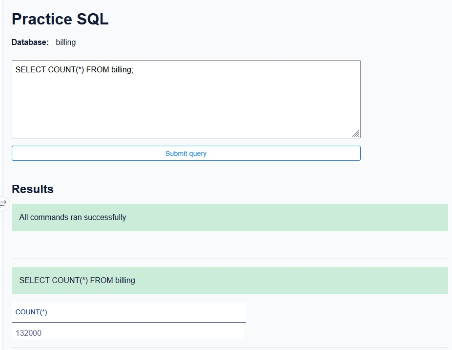
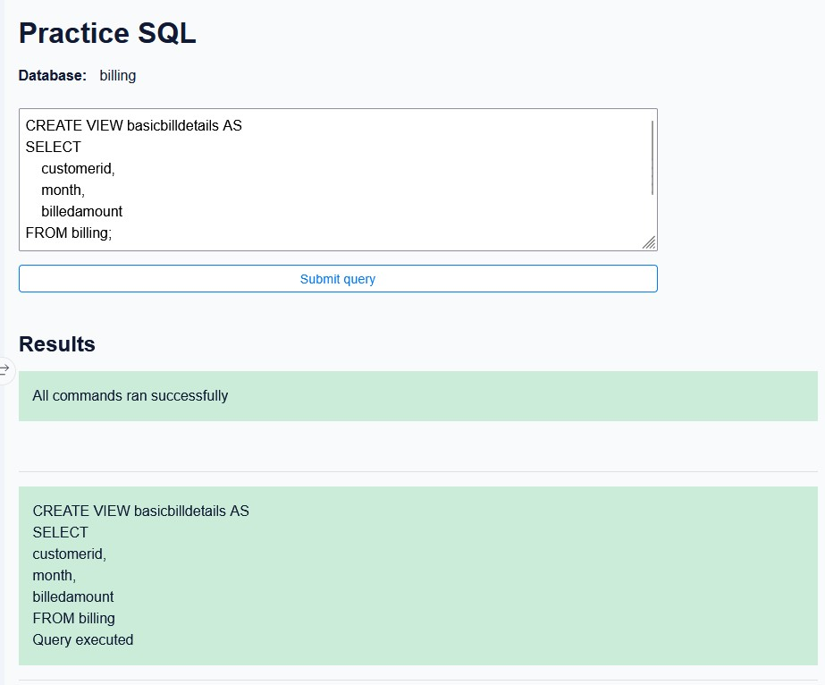
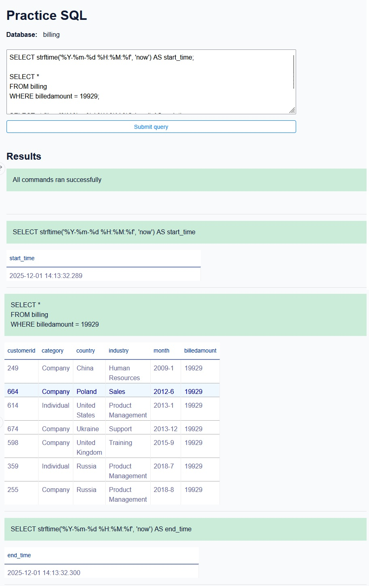
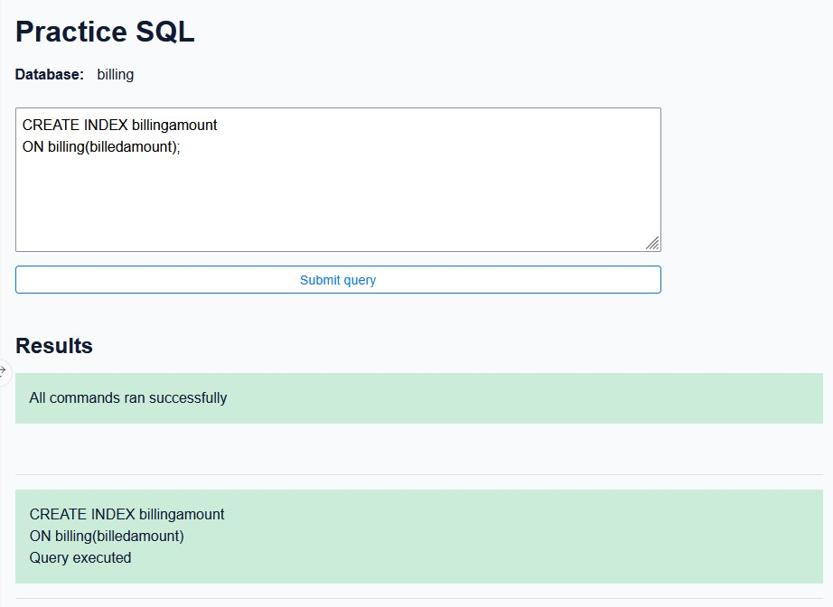
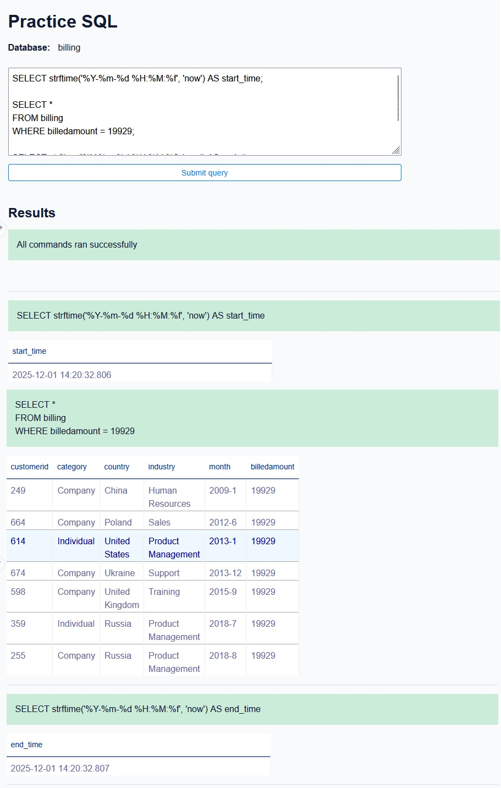

<h1 align="center">Part 3 - Exercise 3.1</h1>  

## ***Task 3.1 - Restore the table billing***  

Click on the menu bar icon with 3 horizontal lines on the upper-right side of Datasette, and select `Add datasets`.  

  

In the section of the Lab Guide called **Dataset Used in this Lab**, right-click on the hyperlink `billing.csv`, and select `Copy link address`.  

  

It will give you the following path.  

```Bash
https://cf-courses-data.s3.us.cloud-object-storage.appdomain.cloud/IBM-DB0231EN-SkillsNetwork/labs/Final%20Assignment/billing.csv?utm_medium=Exinfluencer&utm_source=Exinfluencer&utm_content=000026UJ&utm_term=10006555&utm_id=NA-SkillsNetwork-Channel-SkillsNetworkCoursesIBMDB0231ENSkillsNetwork26763093-2022-01-01
```

Copy and paste it into the Datassette label named Full URL to Dataset, and click on the Create button.  

  

Now, run the following SQL command  

```SQL
SELECT COUNT(*) FROM billing;
```

Take a screenshot of the output, and save it as `restore-table.jpg`.  

  

## Exercise 3.2 - Create a view  

## ***Task 3.2 - Create a view named basicbilldetails with the columns customerid, month, billedamount***

Run the following SQL command  

```SQL
CREATE VIEW basicbilldetails AS
SELECT 
    customerid,
    month,
    billedamount
FROM billing;
```

Take a screenshot of its output, and save it as `2create-view.jpg`.  

  

## Exercise 3.3 - Indexing

## ***Task 3.3 - Baseline query performance***  

As instructed, we'll have to use the command `SELECT strftime(“%Y-%m-%d %H:%M:%f”, “now”);` before and after your query to display the run time.  

To do so, we will write the SQL script  

```SQL
SELECT strftime('%Y-%m-%d %H:%M:%f', 'now') AS start_time;

SELECT *
FROM billing
WHERE billedamount = 19929;

SELECT strftime('%Y-%m-%d %H:%M:%f', 'now') AS end_time;
```

And take a screenshot of its output, which will be saved as `query-base-line.jpg`.  

  

## ***Task 3.4 - Create an index***  

Type the following SQL command to create an index,  

```SQL
CREATE INDEX billingamount
ON billing(billedamount);
```

And save its output as `index-creation.jpg`.  

  

## ***Task 3.5 - Document the improvement in query performance***  

Rerun the SQL query  

```SQL
SELECT strftime('%Y-%m-%d %H:%M:%f', 'now') AS start_time;

SELECT *
FROM billing
WHERE billedamount = 19929;

SELECT strftime('%Y-%m-%d %H:%M:%f', 'now') AS end_time;
```

Take a screenshot of the output, and save it as `query-after-index.jpg`.  


